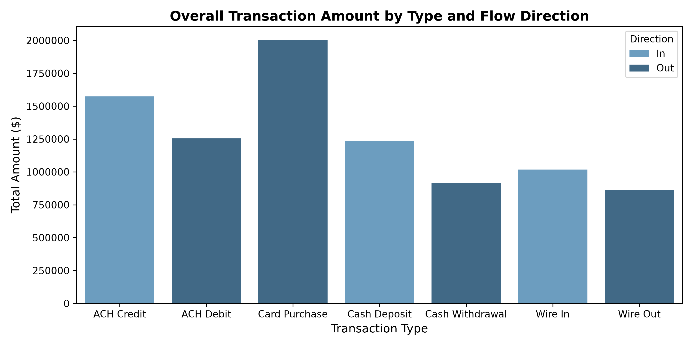
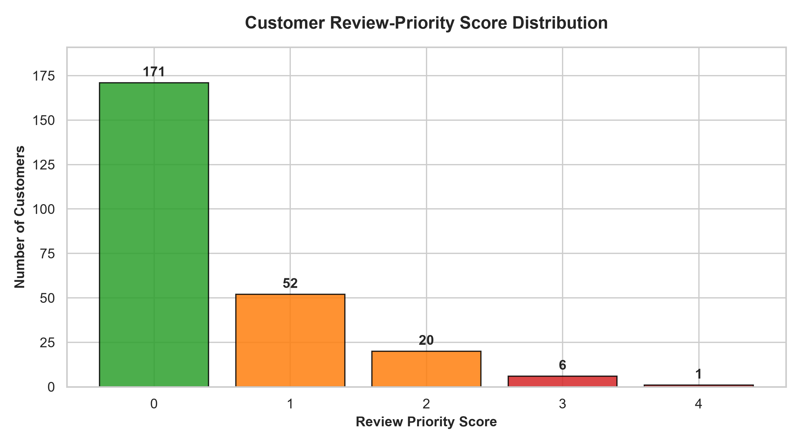

# Meridian Financial Group — AML Transaction Monitoring Analysis

This project uses fictional customer and transaction data for portfolio practice. I used SQL and Python to identify transaction patterns and prioritize customers for further review.

## Business Problem

For this project, Financial Crime Compliance wanted an overview of payment activity and a list of customers who might need a closer review. My goal was to understand the overall activity, identify customers who stood out, and create a simple score to explain which accounts I would review first.

## Dataset

The data are fictional and cover January–June 2026. There are two tables, connected by `customer_id`:

| File | What it contains |
|---|---|
| `aml_customers.csv` | One row for each of 250 customers, including region, customer segment, existing risk rating, occupation, average monthly inflow, and account tenure |
| `aml_transactions.csv` | One row for each of 3,729 transactions, including the customer ID, timestamp, transaction type, direction, amount in USD, country code, and channel |

All customer transaction totals cover the full six months. Total transaction amount includes both money coming in and money going out; it is not an account balance.

## Tools

- PostgreSQL
- Python with pandas and NumPy
- Matplotlib and seaborn
- Jupyter Notebook

## Analytical Approach

### SQL

I used SQL to summarize transaction counts, total amounts, and average amounts by transaction type. I also grouped activity by customer and compared transactions across the existing Low, Medium, and High risk ratings.

To look for rapid wire activity, I matched incoming and outgoing wires for the same customer and checked whether the outgoing wire happened within 24 hours after the incoming wire.

The SQL international wire-out totals include only outgoing wires with a country code other than `US`. In Python, I included both incoming and outgoing international wires in the review score.

### Python

In the notebook, I summarized overall transaction activity and calculated each customer's total transaction amount, cash deposits, and international wires. I then combined those totals with the customer profiles.

I chose four activity indicators:

- High total transaction amount
- High cash-deposit amount
- High international wire amount
- An outgoing wire within 24 hours after an incoming wire

For the first three indicators, I used the 90th percentile to identify customers in the top 10% for each amount. I added a separate point for an existing High risk rating, then used the combined score to create the final case review table.

## Three Strongest Findings

1. **More money went out than came in during this period.** There were **3,729 transactions totaling $8,863,840.64**. Outflows made up **2,361 transactions (63.3%)** and **$5,035,710.27 (56.8% of the total amount)**. Card purchases were the largest transaction type by count and amount, with **1,001 transactions totaling $2,006,495.12**.

2. **59 customers triggered at least one activity flag.** Of those customers, **38 triggered one flag, 15 triggered two, and 6 triggered three**. No customer triggered all four activity flags, and **191 customers triggered none**. The six customers with three flags were **23, 45, 60, 84, 114, and 151**.

3. **Seven customers ranked as Higher review priority.** After including the existing High risk rating in the score, **7 customers were Higher priority, 72 were Medium, and 171 were Lower**. Customer **84** had the highest score of **4** because of high total volume, cash deposits, international wires, and an existing High risk rating.

## Review Prioritization

I gave customers one point for each condition below. The highest possible score is **5**.

| Indicator | What adds a point | Points |
|---|---|---:|
| High total volume | Total transaction amount at or above the 90th-percentile cutoff of about $72,661.39 | +1 |
| High cash deposits | Cash deposits at or above the 90th-percentile cutoff of about $13,894.84 | +1 |
| High international wires | Non-US incoming and outgoing wires at or above the 90th-percentile cutoff of about $6,312.81 | +1 |
| Rapid wire activity | At least one outgoing wire after an incoming wire for the same customer, with a gap greater than zero and no more than 24 hours | +1 |
| Existing High risk rating | The customer's existing risk rating is High | +1 |

The dollar cutoffs shown here are rounded. The code uses the full calculated values. The cash flag uses the top-10% cutoff across the six-month period; it does not use a fixed $10,000 rule.

I grouped the scores into three review priorities:

| Review priority | Score | Customers |
|---|---|---:|
| Lower | 0 | 171 |
| Medium | 1–2 | 72 |
| Higher | 3–5 | 7 |

The existing risk rating is only one part of the score. A customer with a Low existing rating can still rank as Higher review priority based on their transaction activity.

### Customers Recommended for Review

| Customer | Existing risk rating | Score | Why I selected them |
|---|---|---:|---|
| 84 | High | 4 | High total volume, cash deposits, international wires, and an existing High risk rating |
| 23 | Medium | 3 | High total volume, international wires, and rapid wire activity |
| 45 | Low | 3 | High total volume, international wires, and rapid wire activity |
| 60 | Medium | 3 | High total volume, international wires, and rapid wire activity |
| 67 | High | 3 | High cash deposits, international wires, and an existing High risk rating |
| 114 | Low | 3 | High total volume, cash deposits, and international wires |
| 151 | Low | 3 | High total volume, international wires, and rapid wire activity |

The final table in the notebook also includes the dollar amounts and rapid-movement flag for each customer. I sorted the table by score, then by customer ID for customers with the same score.

These are the customers I would recommend reviewing first. The next step would be to look at their individual transactions and request more information about where the money came from and why the payments were made.

## Visualizations

I created two charts: one showing total transaction amounts by type and direction, and one showing how many customers received each review score.





## Limitations

- **The data are fictional.** This project is practice for analyzing transactions and deciding which customers to review.
- **I only had basic customer information.** There were no Know Your Customer (KYC) documents or details about where customers' money came from.
- **There were no transaction descriptions.** I could see the payment type and amount, but not the reason for the payment.
- **There were no past alerts or review results.** I could not check whether these customers had been flagged before or whether an investigator had found a problem.
- **The data cover only six months.** More history would help show whether the activity was unusual for each customer.
- **The score is simple.** I used the same cutoffs for all customers and gave each indicator one point. The score does not account for every customer's circumstances, and it has not been tested against confirmed cases. Cash and wire amounts also contribute to total volume, so the indicators can overlap.
- **Wires close together do not prove the same money moved.** The timing gives an analyst something to review, but it does not explain the connection between the payments.
- **A high score does not prove wrongdoing.** These indicators do not prove fraud, money laundering, or AML violations. A low score also does not mean an account is free of problems.

## Repository Structure

```text
aml_customers.csv
aml_transactions.csv
data_dictionary.csv
aml_analysis.sql
aml_transaction_monitoring.ipynb
chart1_overall_activity.png
chart2_score_distribution.png
README.md
```

## Running the Analysis

1. Keep the notebook and both CSV files in the same folder.
2. Install `pandas`, `numpy`, `matplotlib`, `seaborn`, `ipython`, `jinja2`, and Jupyter in your Python environment.
3. Open Jupyter from the project folder, restart the notebook's kernel, and run all cells in order. The notebook also saves the two charts as PNG files.
4. To run the SQL analysis, load the CSVs into PostgreSQL tables named `aml_customers` and `aml_transactions`. Use numeric types for amounts and a timestamp type for `transaction_ts`.

